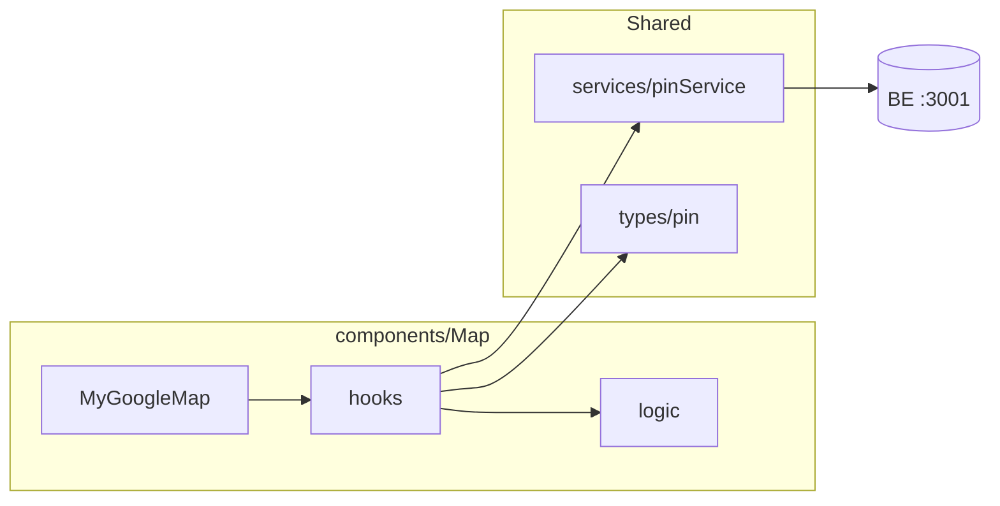

# Vending_Machine_FE フロントエンド構成 — 現状整理と理想設計

最終更新: 2026-06-04（リファクタ完了反映）

このドキュメントは、フロントエンドの**目標構成**と**移行履歴**の指針です。  
Map feature の集約（Phase 1〜4）は完了済みです。

---

## 1. 現在の構成（リファクタ後）

### 1.1 地図 feature（`components/Map/`）

| パス | 役割 |
|------|------|
| `MyGoogleMap.tsx` | 配線のみ（hooks + JSX） |
| `hooks/` | ピン取得・idle・サジェスト・表示フィルタ・操作 |
| `logic/` | `mapUtils`, `convertApiPin` |
| `InfoWindow/InfoWindow.tsx` | ピン詳細 Drawer |

### 1.2 共有レイヤー

| パス | 役割 |
|------|------|
| `services/config.ts` | `API_BASE_URL` / `API_URL` |
| `services/pinService.ts` | map_pins 全件・境界・検索 |
| `types/pin.ts` | `MapPin`, `ApiPin`, `MapBounds` |
| `data/mockMapPins.ts` | API 失敗時のフォールバック用モック |
| `logic/centerSpot/useCurrentLocation.ts` | 現在地（Map / AddPin / EditPin 共有） |

### 1.3 意図的に global のまま

| パス | 理由 |
|------|------|
| `hooks/useAddPin/`, `useAddPinForm/` | 追加画面専用（将来 `components/AddPin/` 化は任意） |
| `hooks/useEditPinForm/` | 編集画面専用 |
| `hooks/useLogin.ts`, `useSignUpPage.tsx`, `useHeaderUser.ts` | 横断関心 |
| `components/ui/MapDisplay`, `MapSelector` | 汎用 presentational |

### 1.4 AddPin の hooks 構成（変更なし）

```
AddPinPage → useAddPinForm（submit / navigate）→ useAddPin（geocoding / API）
```

---

## 2. 理想の設計方針

### 2.1 基本ルール

1. **機能（Feature）単位でまとめる** — 地図は `components/Map/` 以下に UI・hooks・feature 専用 logic を集約
2. **共有だけ `src/` 直下に置く** — 認証、現在地、debounce、geocoding など複数画面で使うもの
3. **HTTP は `services/` に一本化** — hooks 内に `fetch('http://localhost:3001/...')` を書かない
4. **型は `types/` に集約** — `dummyPin/` は廃止し、モックデータだけ別ファイル化
5. **コンポーネントは「配線のみ」** — フィルタ・変換・API は hooks / logic / services へ
6. **barrel export（`index.ts` でまとめて re-export）は使わない** — 各ファイルから直接 import する

### 2.2 レイヤー定義

| レイヤー | 役割 | 置き場所 |
|----------|------|----------|
| **pages** | ルート単位の画面組み立て | `src/pages/` |
| **components/Map** | 地図 feature の UI + feature hooks | `src/components/Map/` |
| **components/ui** | 汎用 presentational（MapDisplay, SuggestList 等） | `src/components/ui/` |
| **hooks**（global） | 認証・ヘッダーなど横断関心 | `src/hooks/` |
| **services** | REST API（fetch のみ） | `src/services/` |
| **logic**（global） | React 非依存の共有ユーティリティ | `src/logic/` |
| **types** | 型定義 | `src/types/` |

---

## 3. 理想のディレクトリ構成（ターゲット）

```
src/
├── pages/
│   ├── AddPinPage.tsx
│   ├── EditPinPage.tsx
│   ├── SignUpPage.tsx
│   └── ...
│
├── components/
│   ├── Map/                        # ★ 地図 feature の唯一の入口
│   │   ├── MyGoogleMap.tsx         # 配線のみ（hooks 呼び出し + JSX）
│   │   ├── hooks/
│   │   │   ├── useMapPins.ts
│   │   │   ├── useMapIdle.ts
│   │   │   ├── useMapSuggestions.ts
│   │   │   ├── useMapInteractions.ts
│   │   │   └── useMapDisplayPins.ts   # 新規: フィルタ + ダミー fallback
│   │   ├── logic/
│   │   │   ├── mapUtils.ts            # 旧 logic/map/mapUtils.ts
│   │   │   └── convertApiPin.ts       # ApiPin → MapPin 変換（共通化）
│   │   └── InfoWindow/
│   │       ├── InfoWindow.tsx
│   │       └── InfoWindowContent.tsx
│   │
│   ├── ui/                         # 汎用 UI（そのまま）
│   │   ├── MapDisplay/
│   │   ├── SuggestList/
│   │   └── ...
│   ├── search/
│   └── HeaderUser/
│
├── hooks/                          # ★ アプリ横断のみ残す
│   ├── useLogin.ts
│   ├── useSignUpPage.tsx           # リネーム推奨: useSingUpPage → useSignUpPage
│   ├── useHeaderUser.ts
│   ├── useAddPin/                  # または将来 components/AddPin/hooks/ へ
│   ├── useAddPinForm/
│   └── useEditPinForm/
│
├── services/                       # ★ HTTP 一元化
│   ├── authService.ts
│   ├── pinService.ts               # map_pins 全件・境界・検索を集約
│   ├── pinDetailService.ts
│   ├── addPinService.ts
│   └── config.ts                   # 新規推奨: API_BASE_URL 定数
│
├── logic/                          # ★ 共有のみ
│   ├── centerSpot/useCurrentLocation.ts
│   ├── debounce/
│   ├── geocoding/
│   └── validation/
│
├── types/
│   ├── pin.ts                      # ApiPin, MapBounds, MapPin
│   ├── addPin.ts
│   └── auth.ts
│
├── data/                           # 新規推奨（任意）
│   └── mockMapPins.ts              # 旧 dummyPin の mapPins 配列のみ
│
└── router/
    └── AppRouter.tsx
```

---

## 4. 削除・統合すべきもの

### 4.1 削除してよい（移行後）

| 対象 | 理由 |
|------|------|
| `services/api.ts` | 未使用。`authService` / `pinService` に統一 |
| `dummyPin/MapPin.tsx` | 型は `types/pin.ts`、モックは `data/mockMapPins.ts` へ |
| `logic/map/mapUtils.ts` | `components/Map/logic/mapUtils.ts` へ移動後に削除 |
| `hooks/useMapPins.ts` 等（4ファイル） | `components/Map/hooks/` へ移動後に削除 |
| `components/MapInfo/` 全体 | `components/Map/InfoWindow/` へ移動後に削除 |
| `Map/index.tsx`, `Map/index.style.css` | 空ファイル |
| `Map/hooks/mapExtention.ts` | 空ファイル |
| `logic/AddPinButton/AddPinButton.ts` | 空ファイル |
| `components/container/` | 空ディレクトリ |

### 4.2 統合（マージ）すべきもの

| 統合先 | 統合元 | 内容 |
|--------|--------|------|
| `services/pinService.ts` | `useMapPins` 内の `fetch('/api/map_pins')` | `fetchAllMapPins()` |
| `services/pinService.ts` | `useMapSuggestions` 内の `fetch('.../search')` | `searchMapPins(query)` |
| `types/pin.ts` | `useMapPins` 内のローカル `ApiPin` | 型の単一ソース |
| `components/Map/logic/convertApiPin.ts` | `useMapPins` / `useMapSuggestions` の `map(...)` | 変換ロジック共通化 |
| `components/Map/hooks/useMapDisplayPins.ts` | `MyGoogleMap` 37–47 行目 | フィルタ + ダミー fallback |

### 4.3 残す（global のまま）

| 対象 | 理由 |
|------|------|
| `logic/centerSpot/` | Map・AddPin・EditPin で共有 |
| `logic/debounce/` | `useMapIdle` 等で利用 |
| `logic/geocoding/` | AddPin / EditPin で利用 |
| `hooks/useLogin.ts`, `useHeaderUser.ts` | 横断関心 |
| `components/ui/MapDisplay` | 純粋 UI。Map feature から利用 |
| `services/authService.ts` | 既に使用中 |

---

## 5. 命名の統一

| 現在 | 理想 |
|------|------|
| `components/MapInfo` | `components/Map/InfoWindow` |
| `dummyPin/MapPin` | `types/pin.ts` + `data/mockMapPins.ts` |
| `hooks/useSingUpPage.tsx` | `hooks/useSignUpPage.tsx` | ✅ |
| `pages/SingUpPage.tsx` | `pages/SignUpPage.tsx` | ✅ |
| `import ... from './mapInfo'` | `import ... from './InfoWindow/InfoWindow'` |
| `logic/map/` | `components/Map/logic/` |

**フォルダ名は `Map`（PascalCase）に統一。** `map` / `Map` 混在は Linux CI で壊れるため禁止。

---

## 6. データ・API の流れ（理想）



- **hooks**: 状態・副作用・派生データ（`displayPins` など）
- **logic**: 純関数（変換、bounds）
- **services**: `fetch` のみ（URL は `services/config.ts` に集約推奨）

---

## 7. AddPin / EditPin の扱い（地図 feature との境界）

| 機能 | 推奨置き場所 | 備考 |
|------|--------------|------|
| メイン地図（一覧・サジェスト・Drawer） | `components/Map/` | 本ドキュメントの主対象 |
| ピン追加フォーム | `hooks/useAddPin*` のまま可 | 専用ページのため。将来 `components/AddPin/` を切ってもよい |
| ピン編集 | `hooks/useEditPinForm/` | 同上 |
| 地図 UI（クリックで位置選択） | `components/ui/MapSelector` | 汎用 UI として `ui/` に残す |

AddPin を Map 配下に入れるかは **任意**。入れるなら `components/AddPin/hooks/useAddPin.ts` 程度に留め、メイン Map とはフォルダを分ける。

---

## 8. 移行手順（完了済み）

| Phase | 内容 | 状態 |
|-------|------|------|
| 1 | 未使用 `api.ts` 削除、空ファイル整理 | ✅ |
| 2 | Map hooks / logic / InfoWindow 集約 | ✅ |
| 3 | `convertApiPin`, `useMapDisplayPins`, `pinService`, `config.ts` | ✅ |
| 4 | `types/pin.ts`, `data/mockMapPins.ts`, `dummyPin` 廃止 | ✅ |
| 5 | `SignUpPage` リネーム、barrel `index.ts` 廃止 | ✅ |

---

## 9. チェックリスト（リファクタ完了の定義）

- [x] `src/hooks/` に `useMap*.ts` が残っていない（`components/Map/hooks/` に集約済み）
- [x] `components/MapInfo/` が存在しない（`Map/InfoWindow` に統一済み）
- [x] `dummyPin/` が存在しない
- [x] `services/api.ts` が存在しない
- [x] Map hooks 内に `http://localhost:3001` の直書きがない（`services/pinService` + `config.ts`）
- [x] `MyGoogleMap.tsx` にフィルタ・fallback のビジネスロジックがない（`useMapDisplayPins`）
- [x] フォルダ名 `map` / `Map` の混在がない（`Map` に統一）
- [x] `npm run build` が通る
- [x] 空フォルダ・空ファイルを削除済み
- [x] `pages/SignUpPage.tsx` に表記統一（`SingUp` 廃止）

---

## 10. 参考: 現在のファイルと移行先対応表

| 現在 | 移行先 | アクション |
|------|--------|------------|
| `hooks/useMapPins.ts` | `components/Map/hooks/useMapPins.ts` | 移動 |
| `hooks/useMapIdle.ts` | `components/Map/hooks/useMapIdle.ts` | 移動 |
| `hooks/useMapSuggestions.ts` | `components/Map/hooks/useMapSuggestions.ts` | 移動 |
| `hooks/useMapInteractions.ts` | `components/Map/hooks/useMapInteractions.ts` | 移動 |
| `logic/map/mapUtils.ts` | `components/Map/logic/mapUtils.ts` | 移動 |
| `components/MapInfo/*` | `components/Map/InfoWindow/*` | 移動・リネーム |
| `dummyPin/MapPin.tsx` | `types/pin.ts` + `data/mockMapPins.ts` | 分割後削除 |
| `services/api.ts` | — | 削除 |
| barrel `index.ts` | — | 廃止（直接 import） |
| `Map/hooks/mapExtention.ts`（空） | — | 削除 |

---

## 11. まとめ

| 質問 | 答え |
|------|------|
| `components` 内に `hooks` があるのは OK？ | **OK**（Map 専用なら `components/Map/hooks/`） |
| 何を消す？ | 未使用 `api.ts`、空ファイル、`dummyPin/`、移行後の旧 `hooks/useMap*` と `MapInfo/` |
| 何に統一？ | **地図 = `components/Map/`**、**HTTP = `services/`**、**共有 = `logic/` + global `hooks/`** |

この MD をベースに Phase 1 から順に進めると、混在を壊さず整理できます。
